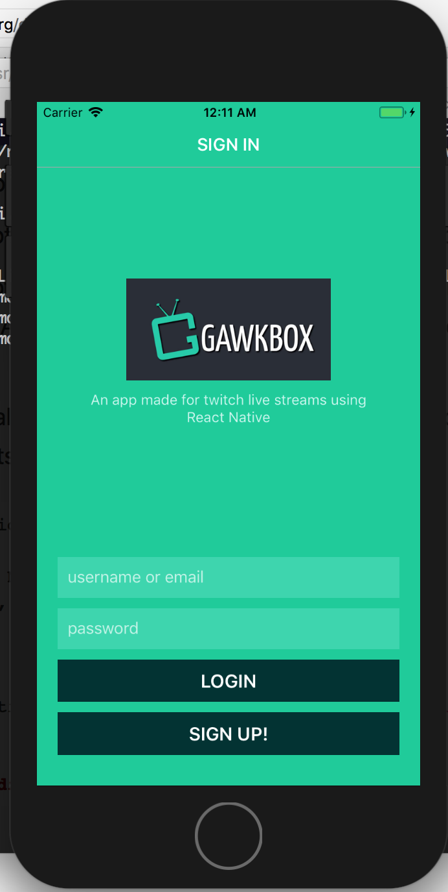
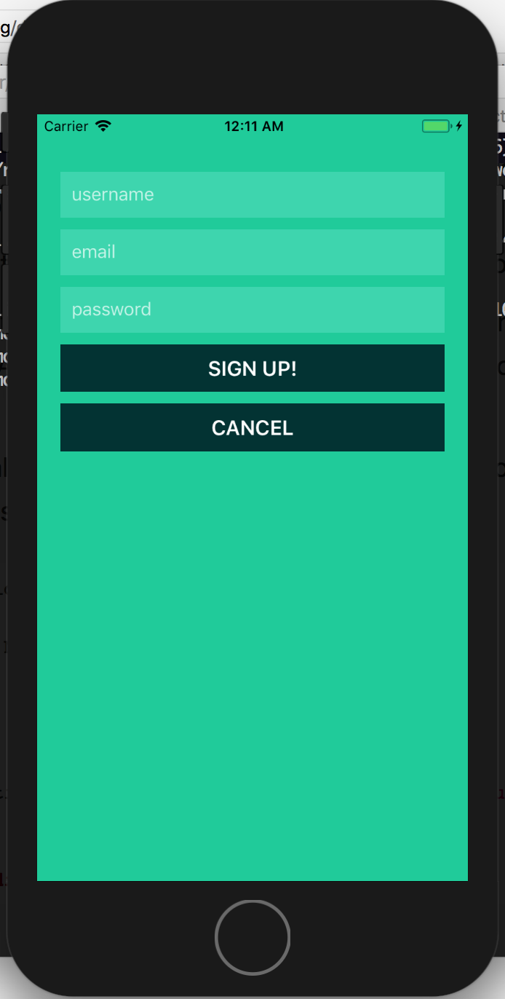
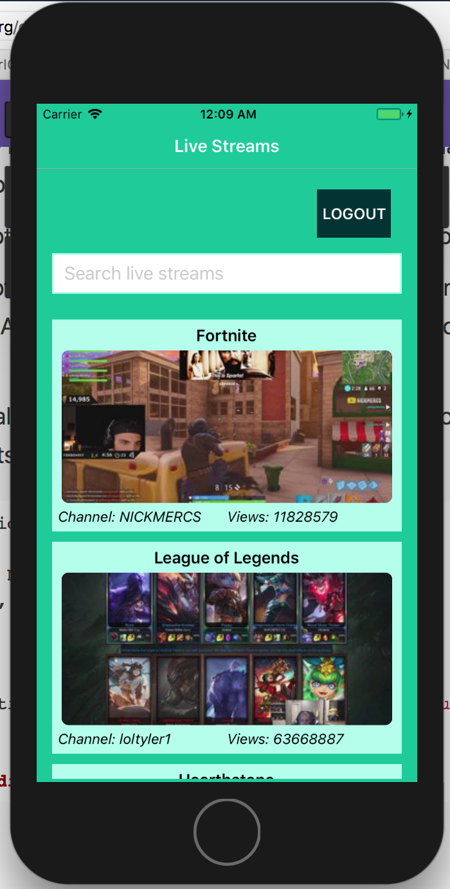
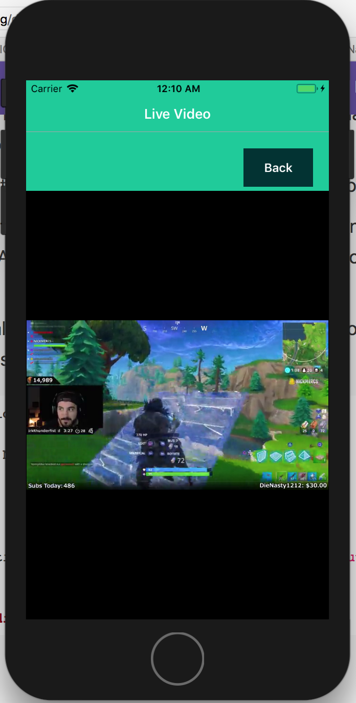

# Twitch live streams
This is a cross platform (iOS & Android) mobile app for streaming twitch live
streams. Developed using React Native for user interface, and Golang server
that communicates with twitch REST API and Mysql database.

## Tech/framework used
<b>Built with</b>
- [Go](https://golang.org)
- [React Native](https://facebook.github.io/react-native/)
- [MySQL](https://www.mysql.com)
- [Docker](https://www.docker.com)

## Screenshots





## Installation and Setup
This app requires you to install [Golang](https://golang.org/dl/) and get familiar
with [Go Workspaces](https://golang.org/doc/code.html#Workspaces) and
[GOPATH environmental variable](https://golang.org/doc/code.html#GOPATH). Then
download [Docker](https://www.docker.com/community-edition#/download) to spin-up
Golang and Mysql containers.

##### Spinning-up Golang server container
Clone the project repository and place it under `$GOPATH/src`.
```
cd $GOPATH
mkdir -p src
git clone https://github.com/mgiridhar/twitch_streams.git ./src
cd gawkbox_assignment/
```

Modify the `MYSQL_IP` parameter in config/config.json file to match the Mysql
container's IP address.

Build a docker image for the Golang web-server, and spin up a docker container
that serves at port `8080`.
```
docker build -t web_server_image .
docker run --publish 8080:8080 --name web_server --rm web_server_image
```

##### Spinning-up Mysql container
Pull a MySQL Docker image using the below command:
```
docker pull mysql/mysql-server:latest
```

Using the mysql image created, run the below command to deploy the mysql container,
```
docker run --name=mysqldb -e MYSQL_ROOT_PASSWORD=asdqwe -e MYSQL_USER=gawkbox \
        -e MYSQL_PASSWORD=asdqwe123 -e MYSQL_DATABASE=gawkbox \
        --mount type=bind,src=$GOPATH/src/scripts/,dst=/docker-entrypoint-initdb.d/ \
        -d mysql/mysql-server:latest
```
You can find more information on running mysql docker containers [here](https://dev.mysql.com/doc/mysql-installation-excerpt/5.7/en/docker-mysql-more-topics.html)

Make sure the MYSQL credentials in the above command and in the `config/config.json` are same.

##### Connect to MySQL from Golang application in another Docker container
This image exposes the standard MySQL port (3306), so container linking makes the MySQL
instance available to Go application container. Start your application container like this
in order to link it to the MySQL container:
```
docker run --name server_db_link --link mysqldb:mysql -d web_server_image
```

#### Running the app in iOS/Android Simulator
Assuming you have setup your iOS and Android simulator, and installed [npm](https://www.npmjs.com).

Install react-native client,
```
npm install react-native-cli
```

Install dependency react-navigation,
```
npm install react-navigation
```

Initialize a react-native app,
```
react-native init live_streams
```

Copy the contents of `$GOPATH/src/react-native` into live_streams,
```
cp $GOPATH/src/react-native/* live_streams/
cd live_streams
```

Run the following command depending on platform in the `live_streams` directory,
```
react-native run-ios
(or)
react-native run-android
```

Fire the app in simulator from another terminal under the same react-native app directory,
```
react-native start
```

While running the app in iOS simulator, you might encounter the below error message saying,
```
Error Loading Page
Domain: NSURLErrorDomain
Error Code: -1022
Description: The resource could not be loaded because
the App Transport Security policy requires the use of a
secure connection
```
In that case, follow the instructions in [this link](https://blog.bigbinary.com/2016/07/27/open-non-https-sites-in-webview-in-react-native.html).

## TO DO
- Unit tests
- Integrate OAuth
- Encrypt password while storing it in database
- Handle memory leak error
